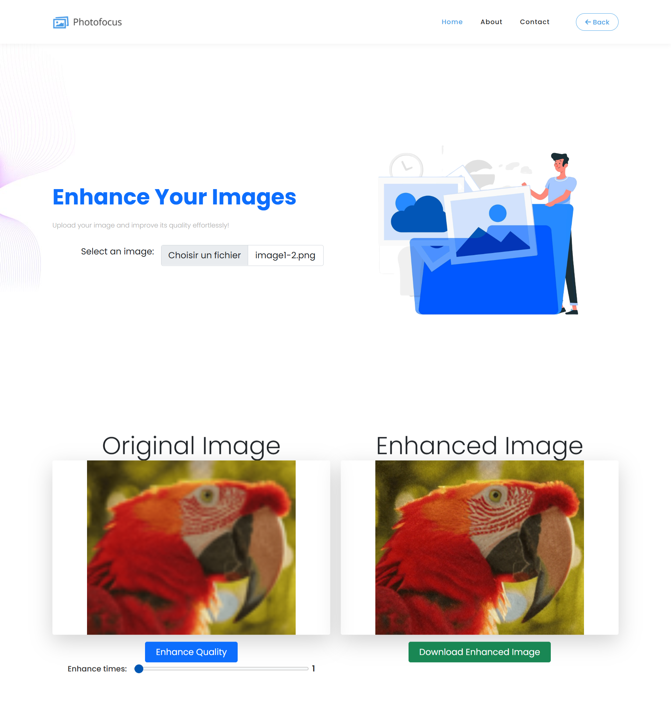

# PhotoEnhance - Amélioration de la qualité des images

Ce projet permet d'améliorer la qualité des images téléchargées en utilisant un modèle de traitement d'images. L'utilisateur peut télécharger une image via une interface web, et l'application renvoie une version améliorée de cette image.

## Fonctionnalités

- **Téléchargement d'image** : L'utilisateur peut télécharger une image depuis son appareil.
- **Amélioration de la qualité de l'image** : Après téléchargement, l'image est traitée et améliorée en utilisant le modèle ESRGAN.
- **Téléchargement de l'image améliorée** : L'utilisateur peut télécharger l'image améliorée.

## Prérequis

- Python 3.7 ou supérieur
- Flask
- Pillow (bibliothèque de traitement d'image)
- PyTorch

## Installation

1. Clonez ce dépôt sur votre machine locale :
   

2. Accédez au dossier du projet :
    ```bash
    cd photoenhance
    ```

3. Installez les dépendances :
    ```bash
    pip install -r requirements.txt
    ```
4. Vous pouvez tester l'application avec les images du dossier ImageToTest car ces images ne sont pas trop volumineuses.

## Lancer l'application

Pour démarrer l'application Flask en mode développement, exécutez la commande suivante :

```bash
python app.py
```


*
*
*

*
*
*
*
*


## Voici quelques captures d'écran de l'application :

## Page d'accueil


## Image améliorée

